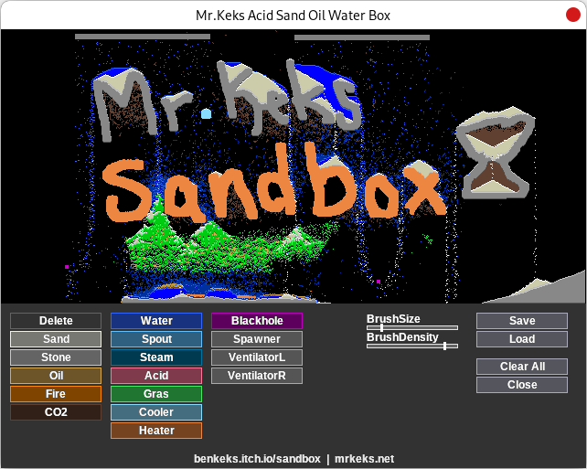

Mr.Keks Sandbox
===============

[](https://benkeks.itch.io/sandbox)

Hey there! I'm happy that you managed to download my game and to open the ReadMe-file! Not many people do. Whops, did I just say “my game”? Well, I usually prefer calling it *a toy*, as---well---in a game there's usually a certain task. In this toy, you can do what you want. Just play around with all the stuff.

You can build your own little worlds full of falling sand, boiling water, burning oil and other stuff like this.

The **controls** work as follows: Click on a material button to select the material you want to paint with. You can also change the size and the density of your brush using the sliders. I suggest you find out what the materials' properties are, by trying.

There are also three kinds of objects you can place:

- Black holes will absorb everything around them (the radius is determined by the brush size).
- Spawners create new particles of the last material you selected before placing the spawner. Their width is determined by the brush size, whereas the amount of material created is given by the brush density.
- Ventilators will move the particles horizontally if there's space.

All special objects can be removed by clicking on them with right mouse button.

On the right-hand side of the screen, you'll find the buttons `Save`, `Load`, `Clear all` and `Close`... Errm, and they do exactly what one would expect 'em to when you look at their names. The Save-Button won't ask you for a file name, but just save the current scene to a file with an incremented number as file name. By the way: You can also open files, by dragging 'em on `sand.exe` (=, or supplying their name via terminal as argument. For instance, the following will open a sample world:

```
sand.exe 0.sand
```

Well, I hope you enjoy my game. If you do, why don't you drop me a line?

- https://benkeks.itch.io/sandbox
- https://mrkeks.net
- ben@mrkeks.net

(The original German threads with comments can be found at https://www.blitzforum.de/forum/viewtopic.php?t=20682, https://mrkeks.net/mr-keks-sandbox/, and https://www.blitzforum.de/forum/viewtopic.php?t=21366.)

Have fun!

Mr.Keks  
Berlin, 2006-12-26  
(GitHub release 2023-12-29)

(P.S. The toy is of course freeware! The bb-source code is included - feel free to change it,
 but please notify me if you consider republishing it. It must still be obvious that I'm
the original author of this software!)

-----

To build the game from source, you'll need [Blitz3d](https://github.com/blitz-research/blitz3d). The following command will compile the game:

```
blitzcc -o sand.exe main.bb
```

The most recent version of the source can be obtained from https://github.com/benkeks/sandbox.

For technical reasons, this repository contains a copy of `fmod.dll` that would otherwise be supplied by the Blitz3d installation.

Some parts of the code are plagued by manual inlining that paid off with the Blitz compiler back in 2006, but today mostly means that it's harder to maintain. Sorry for that!